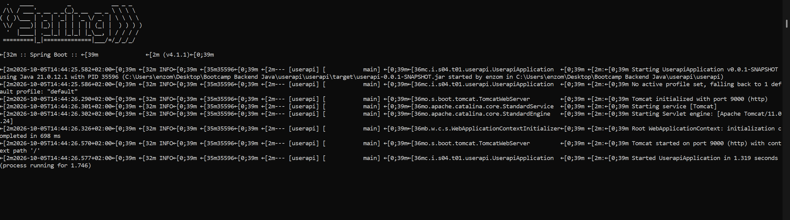
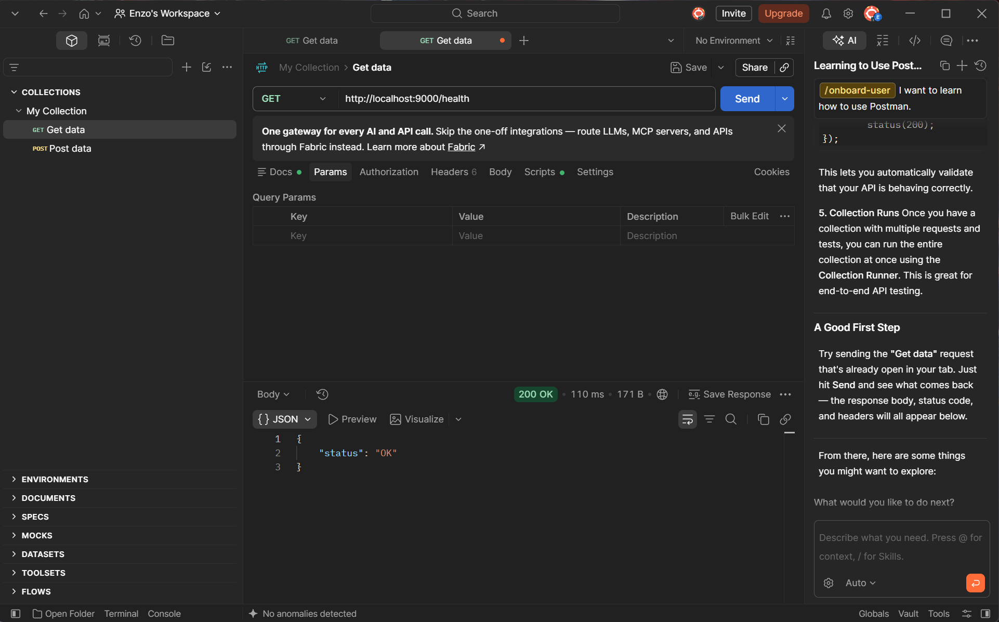

# Sprint 4 - Spring Boot Tasca 1

Sprint 4

Crear la primera API REST con Spring Boot y trabajar con peticiones HTTP, JSON, testing, arquitectura por capas, inyección de dependencias y TDD.

## Tecnologías utilizadas

- Java 21
- Spring Boot
- Spring Web
- Maven
- JUnit 5
- Mockito
- MockMvc
- Postman
- IntelliJ IDEA
- Git
- GitHub

## Funcionalidades realizadas

API REST para la gestión de usuarios en memoria.

Las principales funcionalidades implementadas son:

- Endpoint de comprobación del estado de la aplicación.
- Gestión de usuarios en memoria.
- Listado de usuarios.
- Creación de nuevos usuarios.
- Generación automática de identificadores UUID.
- Búsqueda de usuarios por ID.
- Gestión del error cuando un usuario no existe.
- Filtrado de usuarios por nombre.
- Validación para evitar emails duplicados.
- Respuestas en formato JSON.

## Arquitectura

He segudo una arquitectura por capas:

- **Controller**: gestiona las peticiones y respuestas HTTP.
- **Service**: contiene la lógica de negocio.
- **Repository**: gestiona el acceso a los datos.
- **Model**: representa las entidades de la aplicación.
- **Exceptions**: contiene las excepciones personalizadas.

La aplicación utiliza inyección de dependencias mediante Spring para desacoplar las capas.

## Persistencia

No se utiliza una base de datos.

Los usuarios se almacenan temporalmente en memoria mediante una implementación de Repository basada en una lista.

## Pruebas realizadas

La he probado de forma manual y automática.

### Pruebas manuales

Se ha utilizado Postman para comprobar:

- Endpoint de Health.
- Creación de usuarios.
- Listado de usuarios.
- Búsqueda por ID.
- Filtrado por nombre.
- Respuestas de error.

### Tests automáticos

Se han realizado tests de diferentes niveles:

- Capa web con MockMvc.
- Tests de integración con Spring Boot.
- Tests del Repository.
- Tests del Service.
- Tests con Mockito para aislar dependencias.
- Tests de la validación de emails duplicados.

## TDD

La validación de emails duplicados siguiendo TDD.

Primero he hecho el test que define el comportamiento y posteriormente la funcionalidad necesaria para hacerlo pasar.

## Problemas

Durante la ejecución de los tests algunos tests compartían el estado del repositorio en memoria. Me ha provocado 2 fallos después de añadir la validación 

de emails duplicados.

Lo he solucionado haciendo que cada test de integración comience con un contexto limpio de Spring, evitando que los datos creados por un test afectaran a los siguientes.

## Ejecución de la aplicación

- Desde IntelliJ IDEA.
- Ejecutando el archivo JAR generado.
- Realizando peticiones desde navegador y Postman.

